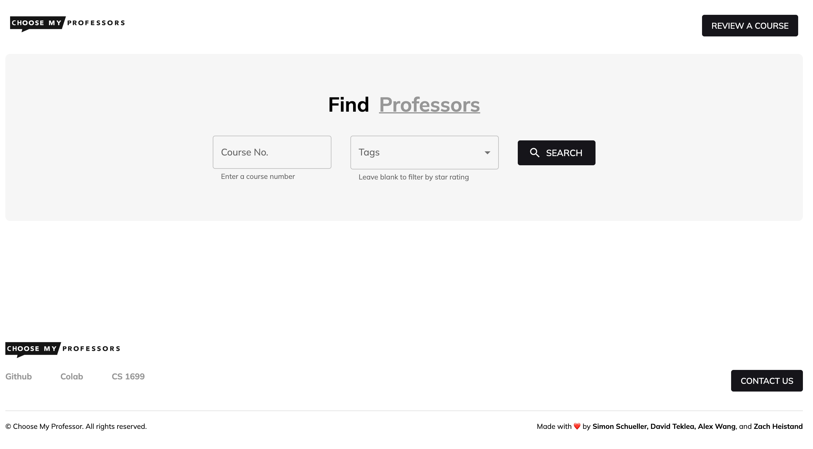
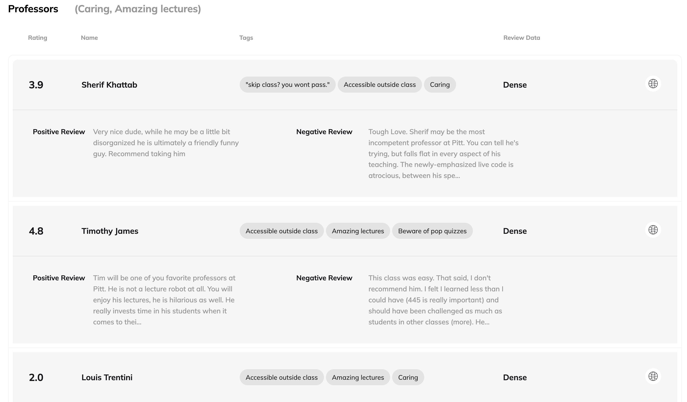
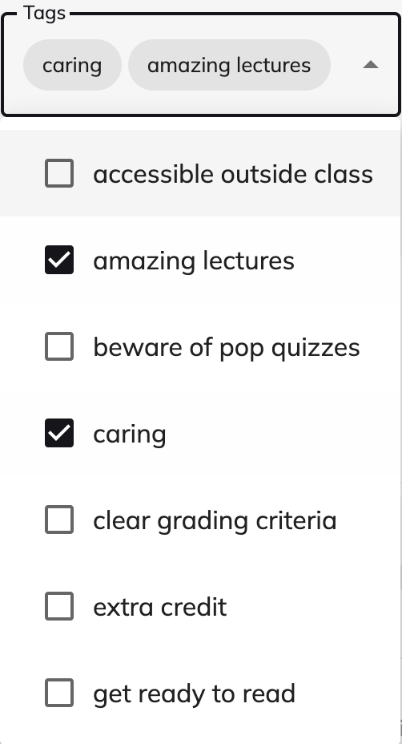

# Choose My Professor

## **Description**

Finding the right professor for the course you wish to take is hard. [Rate My Professors](https://www.ratemyprofessors.com/) does an ok job but it can be better. First, Choose My Professor maps its search from courses to professors so you can immediately view all the professors who teach a given course. Second, Choose my Professor does NLP sentiment analysis on every review for a professor's class to give you meaningful insights at a glance. Instantly get a vibe check on a professor's course to plan your schedule accordingly. Choose My Professor solves the problem of connecting students with professors who align with their academic goals.

## **Role**

I had a vision for Choose My Professor as a part of a semester long practical AI/ML project as a part of the CS1699 course at the University of Pittsburgh. I collaborated with three other students at the University of Pittsburgh and was the team lead for this project.

## **Skills Utilized**

\- NLP
- Python
- nltk
- Flask
- AWS
- javascript
- React
- Github
- Netlify
- Selenium

## **Contribution**

As team lead for this project, I managed delegation of tasks and ensured that all our deadlines for the project were met. From a programming perspective, I coded up the whole frontend with React, worked on fine tuning our models, wrote a flask API to serve model predictions, and hosted our flask API on AWS.

## **Outcome**

- Received A+ in CS1699 Course
- Working project demo hosted publicly [Site](https://choose-my-professor.netlify.app/)

## **Key Takeaways**

From this project I learned how to manage other developers to cultivate a collaboration where each individual' skills compliment the others to achieve outcomes I could not have otherwise reached on my own.

Another key learning from this project came when observing the cold starts that AWS lambda gives when serving our API. The project is in need of a database since currently everything is loaded into memory and takes a significant amount of time. I learned that engineering decisions regarding performance are critical to the usability of an application.

### Screenshots / Visuals (if applicable)

### Further Information

If you're interested in more details about this project, feel free to visit the [GitHub repository](https://github.com/sim1029/choose-my-professor) for the project.