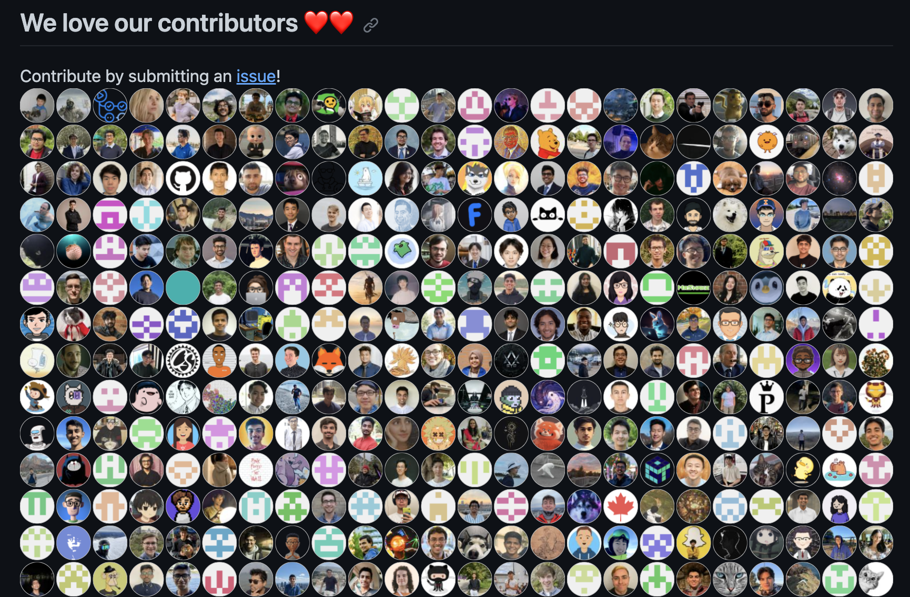
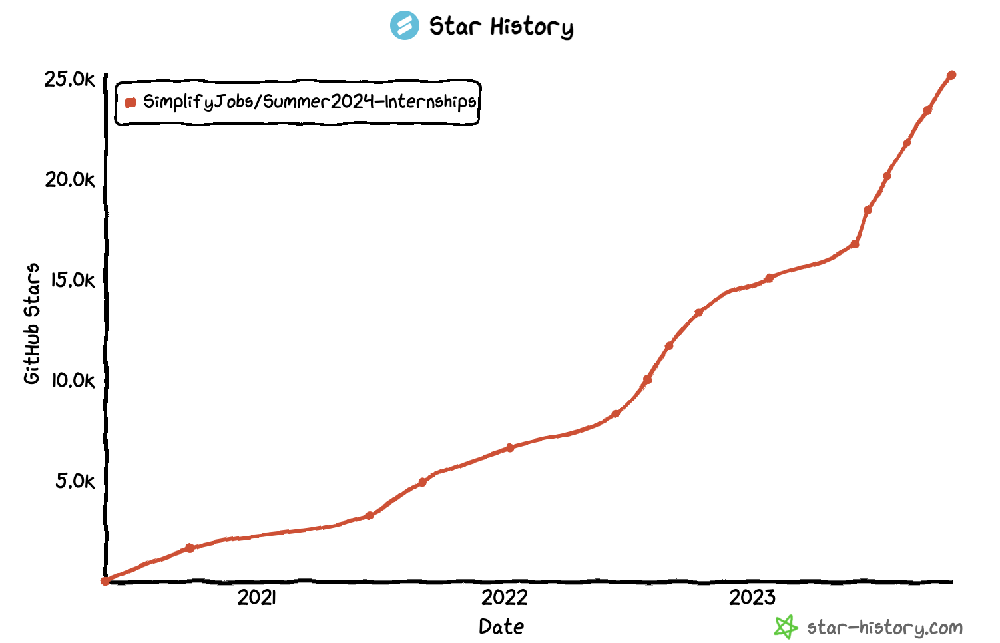

# Maintainer of PittCSC Internship Repository

## **Description**

A member of PittCSC created the most popular repository for finding SWE related internship opportunities. For one year, during my own internship search, I helped to merge pull requests to keep the opportunities list up to date.

## **Role**

Github Contributor

## **Skills Utilized**

* Github
* Markdown

## **Contribution**

Reviewed and merged a number of pull requests for the pittCSC internship repository (now SimplifyJobs repository). Added [All Contributors](https://github.com/all-contributors/all-contributors/blob/master/README.md) section of the readme to replace old running list of individual contributors.

## **Outcome**

Repository was sold by club to SimplifyJobs tool and continues to benefit thousands of SWE jobseekers yearly!

## **Key Takeaways**

Paying it forward to opensource projects that you have benefited from is crucial.

## Screenshots

Section of the repo where I added the all-contributors image

Stars of the Repository over time

## Further Information

If you're interested in contributing to this project, checkout the [Github Repo](https://github.com/SimplifyJobs/Summer2024-Internships)