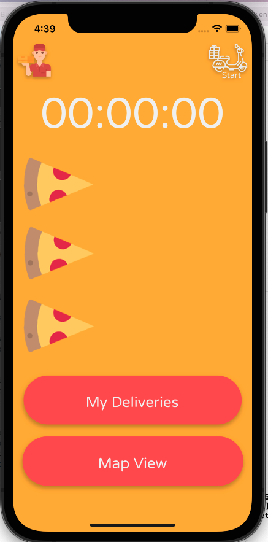
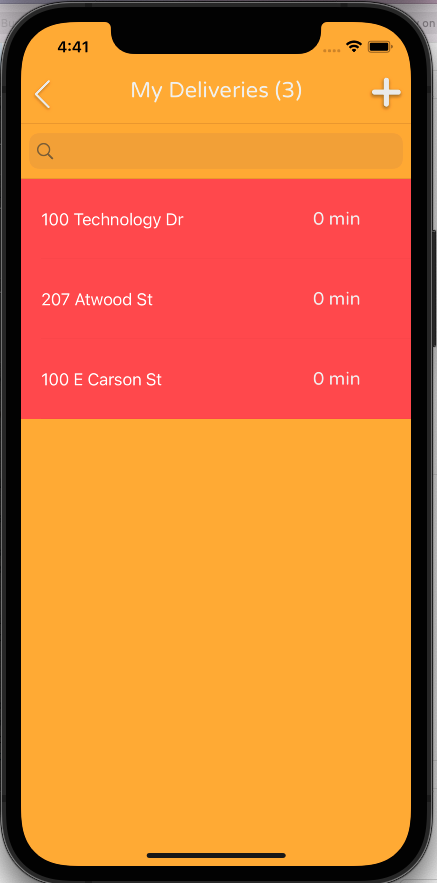
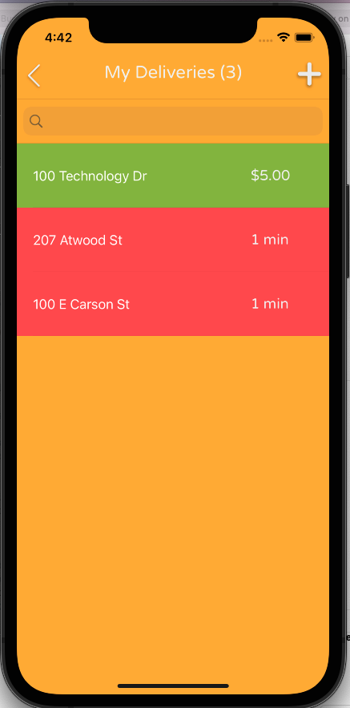
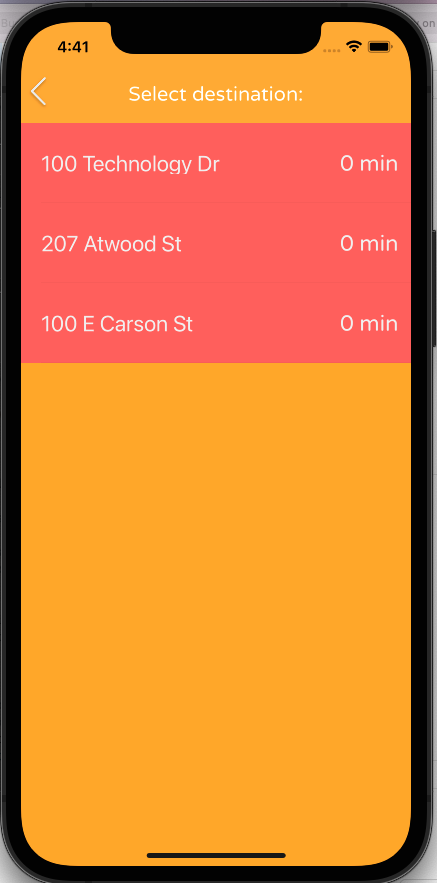
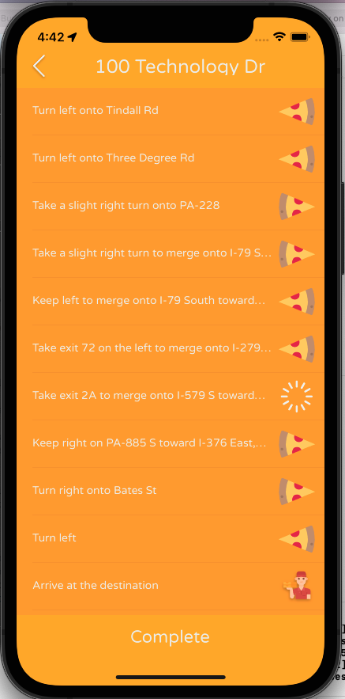
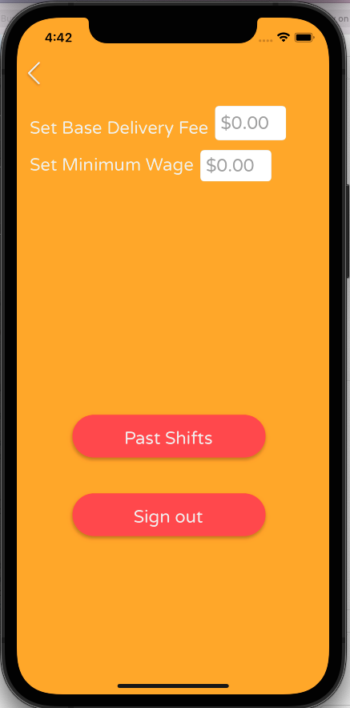
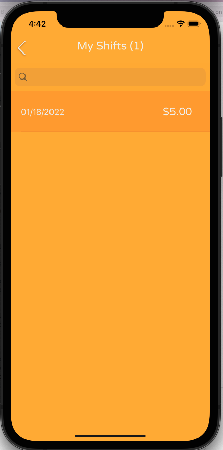
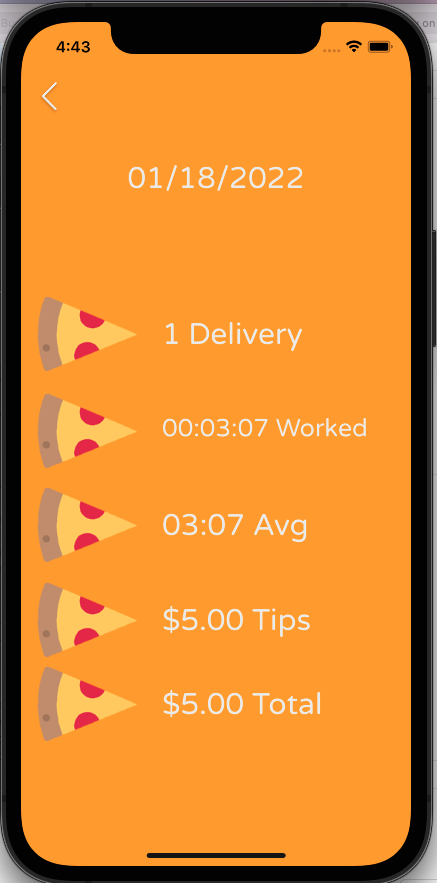

# Pizza Buddy

## **Description**

During the COVID-19 pandemic I worked a job as a pizza delivery driver. I wanted to created a companion application for my shifts which compiled helpful metrics and provided custom mapping features which I desired.

## **Role**

Sole Developer

## **Skills Utilized**

* Swift
* Swift UI
* Mapkit
* Google Maps API

## **Contribution**

Right before coming to the University of Pittsburgh I got a macbook for school. I decided to learn how to program through swift to create an app which would help me with my job. This sparked my love for computer science and filling needs in my own and other's lives through software.

I created an iOS native application which tracked important shift metrics and provided text only directions with multiple stops.

## **Outcome**

Pizza Buddy allowed me to effectively group customer orders to deliver pizza orders faster and increase my tips 😙

## **Key Takeaways**

Let the problem you wish to solve drive which technologies you learn/use in a project. If all you have is a hammer, everything looks like a nail.

### Screenshots / Visuals (if applicable)

Welcome Screen

Home Screen

Deliveries Screen

Destinations Screen

Directions Screen

Tip Screen

Settings

Past Shifts

### Further Information

This project is archived and was never released to the Appstore on account of their $100 charge for developers per year. However I did use a prototype version during my shifts as a driver and it was awesome